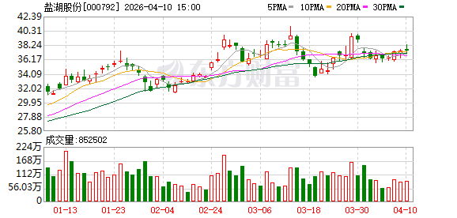

# 盐湖股份(000792.SZ) 股票分析报告

**报告日期**: 2026-04-12  
**当前价格**: 37.41元  
**52周区间**: 37.1 - 38.3元

---

## 一、公司概况

**青海盐湖工业股份有限公司**是中国的盐湖资源龙头企业，主要业务包括：

- **氯化钾**：国内最大的钾肥生产基地
- **碳酸锂**：盐湖提锂技术领先
- **其他盐湖资源开发**

---

## 二、技术分析

### 2.1 K线形态

**K线形态观察**：
- 近期K线呈现**上升趋势**
- 底部区域成交量较大，显示有资金入场
- 近期成交量有所放大，上涨动力增强

### 2.2 移动平均线(MA)

| 均线 | 数值 | 与现价对比 |
|------|------|------------|
| MA5 | 36.95元 | 低于现价 ✅ |
| MA20 | 36.75元 | 低于现价 ✅ |
| MA60 | 35.43元 | 低于现价 ✅ |

**均线状态**: 多头排列 ✅

### 2.3 技术指标

| 指标 | 数值 | 信号 |
|------|------|------|
| RSI | 54.1 | 中性偏强 |
| MACD | 动能增强 | 买入信号 ✅ |
| 成交量 | 放大 | 配合良好 ✅ |

### 2.4 压力与支撑

| 类型 | 价格 | 说明 |
|------|------|------|
| **压力位** | 38.3元 | 52周高点 |
| **支撑位** | 37.1元 | 52周低点 |

---

## 三、财务数据

| 指标 | 数值 |
|------|------|
| 市盈率(PE) | 23.36 |
| 市净率(PB) | 4.4 |
| 总市值 | 约1980亿 |

**2025年年报摘要**：
- 营业收入：155.01亿元（+2.43%）
- 归母净利润：84.76亿元（+81.76%）
- 氯化钾产量：490.02万吨
- 碳酸锂产量：4.65万吨

---

## 四、综合结论

### 技术面：强势 ✅

- 股价位于多条均线上方，均线多头排列
- RSI(54.1)和MACD显示市场强势
- 成交量配合良好

### 基本面：良好 ✅

- 业绩大幅增长，净利润增81%
- 钾肥+锂盐双主业稳健

### 风险提示

⚠️ 38.3元为52周高点，突破后上涨空间打开

---

## 五、投资建议

| 维度 | 评级 |
|------|------|
| 短期技术面 | ⭐⭐⭐⭐ 较强 |
| 中期基本面 | ⭐⭐⭐⭐ 良好 |
| 机构评级 | 买入（多家券商） |

**关键价位**：
- 突破38.3元 → 积极关注
- 跌破37.1元 → 控制风险

---

*本报告由GLM模型分析生成，仅供参考，不构成投资建议*
