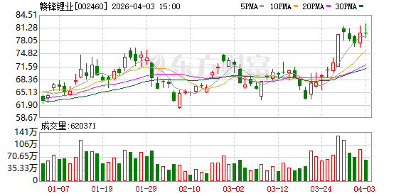
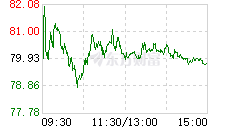

# 📊 赣锋锂业 (002460.SZ) 股票分析报告

> **分析时间：** 2026年4月4日 | **当前股价：** 79.75元（今日-0.23%）| **市值：** ~1672亿元 | **H股：** 01772.HK

---

## 一、📈 技术面分析

*图1：日K线图 — 股价处于上升通道，均线多头排列*

*图2：分时图 — 今日震荡走势，开盘79.93元→最低78.80元→收盘79.75元*

### 1.1 走势概览

股价从2025年低点28元附近启动，最高触及82.19元（52周高点），近期在77-82元区间震荡整固。当前处于**上升趋势中的回调整固阶段**，尚未破位。

### 1.2 均线系统

| 均线 | 数值 | 状态 |
|------|------|------|
| MA5 | 79.10 | 价格上方 |
| MA20 | 71.91 | 价格下方 |
| MA60 | 69.61 | 价格下方 |
| **均线排列** | **多头排列** | 看涨信号 |

### 1.3 支撑与压力

| 类型 | 价位 | 意义 |
|------|------|------|
| **压力1** | 82.19元 | 52周高点，今日未能突破 |
| **支撑1** | 78.80元 | 今日低点，4月1日曾跌破后收回 |
| **支撑2** | 77元 | 心理关口，4月1日"巨震4%"位置 |
| **支撑3** | 72元 | MA20均线支撑 |

### 1.4 今日分时解读

- **开盘：** 79.93元（平开）
- **最高：** 82.19元附近（触及压力位后回落）
- **最低：** 78.80元（获得支撑）
- **收盘：** 79.75元（-0.23%）
- **成交量：** 较前日萎缩（vol_ratio=0.97），主力净流出1.27亿元

### 1.5 关键技术信号

| 指标 | 数值 | 信号 |
|------|------|------|
| RSI | 65.9 | 中性偏强（未超买） |
| MACD柱状图 | 1.1217 | 动能减弱（但仍为正） |
| 均线排列 | MA5>MA20>MA60 | **多头排列** |
| 趋势判断 | 上升通道整固 | 中性偏强 |

---

## 二、💰 基本面分析

### 2.1 核心财务数据

| 指标 | 数值 | 备注 |
|------|------|------|
| 市值 | ~1672亿元 | A+H股合计 |
| PE（滚动） | 103.67 | 偏高，反映市场对未来预期 |
| PB | 3.7 | 适中 |
| 52周高 | 82.19元 | 距高点仅-3% |
| 52周低 | 28.00元 | 当前距低点+185% |

### 2.2 关键解读

> 📌 **东吴证券2026年1月预测（最乐观）：**
> - 2025年净利润：14.8亿（同比+172%）
> - **2026年净利润：94亿（同比+532%）**
> - **2027年净利润：109亿（同比+16%）**
> - 目标价：112元

> 📌 **中金公司2026年4月最新评级：**
> - 评级：**跑赢行业**
> - 目标价：87.43元
> - 预测2026年净利润：48.25亿元

> 📌 **华泰证券评级：**
> - 评级：增持
> - 目标价：92.4元
> - 预测2026年净利润：64.65亿元

### 2.3 行业基本面

- **储能业务进入爆发式增长通道**，2026年仍将延续
- **AI算力中心备用电源**需求攀升，带来额外增量
- **中东地缘事件**推动东南亚、澳大利亚电动化加速
- 锂价具备较强底部支撑，下游车企容忍度高

---

## 三、💵 资金流向分析

### 3.1 主力资金动向

| 日期 | 主力净流入 | 散户净流入 | 方向 |
|------|-----------|-----------|------|
| 4月3日 | **-1.27亿元** | -1.05亿元 | 主力净流出 |
| 3月27日（涨停日） | **+8.23亿元** | — | 机构+游资抢筹 |
| 本周合计 | **+27.29亿元** | — | 净流入居首 |

### 3.2 资金面分析

- **近期最大亮点：3月27日涨停**，三家机构买入3.03亿元，一线游资+量化资金联手抢筹，当日净买入8.23亿元（占总成交8.17%）
- **本周主力净流入27.29亿元**，在锂电材料概念中净流入居首
- **今日（4月4日）主力净流出1.27亿元**，属于正常获利了结，整固性质

---

## 四、📰 近期关键事件时间线

| 日期 | 事件 | 影响 |
|------|------|------|
| 3月27日 | 涨停！三家机构买入3.03亿，游资+量化资金抢筹8.23亿 | 🟢 强势突破 |
| 3月28日 | 本周主力净流入27.29亿元，锂电材料概念榜首 | 🟢 资金追捧 |
| 3月31日 | 公司表示：储能进入爆发式增长通道，AI算力备用电源需求攀升 | 🟢 行业利好 |
| 4月1日 | 股价巨震4%，一度跌破77元关口 | ⚠️ 短期波动 |
| 4月3日 | 中金公司发布"跑赢行业"评级，目标价87.43元 | 🟢 机构看好 |
| 4月3日 | 大和上调赣锋锂业H股评级至"跑赢大市"，目标价85港元 | 🟢 港股利好 |
| 4月4日（今日） | 主力净流出1.27亿元，股价小幅回调整固 | ⚠️ 正常调整 |

---

*═══ 以上是证据和数据，以下是基于证据的判断 ═══*

## 五、🔮 综合判断

**总评级：** 🟡 **中性偏强 / 逢低关注**

**一句话总结：** 基本面强劲（储能+锂需求爆发、机构密集看多）叠加技术面强势（均线多头、接近52周高点），但短期获利盘压力需消化，建议等待回调至77-78元支撑位再考虑介入。

---

### 5.1 🟢 看涨因素

1. **储能业务进入爆发通道**：公司明确表示储能领域已爆发，2026年仍将延续，直接受益于碳中和+AI算力需求
2. **机构集体看多**：中金/华泰/东吴/大和四大机构近期密集发布看多报告，目标价87-112元（较当前有10-40%空间）
3. **资金持续涌入**：本周主力净流入27.29亿元居首，3月27日获机构+游资联手抢筹
4. **均线多头排列**：MA5/20/60依次向上排列，上升趋势未破
5. **H股评级上调**：大和从"跑输"一举上调至"跑赢大市"，目标价从53港元大幅上调至85港元

### 5.2 🔴 看跌因素

1. **PE高达103.67**：估值偏高，股价已充分反映乐观预期
2. **52周高点压力**：82.19元为强压力，今日未能突破
3. **MACD动能减弱**：柱状图从1.1984收窄至1.1217，短期上涨动能衰减
4. **今日主力净流出**：获利了结压力，连续上涨后有整固需求
5. **锂价波动风险**：锂作为大宗商品，价格波动可能影响盈利预测

---

### 5.3 操作建议

| 投资者类型 | 建议 |
|-----------|------|
| **已持仓者** | 持有，78元止损。目标80-82元区间可适当减仓 |
| **观望者** | 等回调至77-78元支撑位再分批建仓，不追高 |
| **短线激进者** | 79-80元区间高抛低吸，止损77元 |

**A/H股对比：**
- A股（002460）流动性好，机构覆盖多
- H股（01772）大和目标价85港元，汇率折算后溢价有限

---

## 六、🎯 翻转条件

### 向上翻转 🟢（加仓/买入信号）

| 触发条件 | 逻辑 |
|---------|------|
| 放量突破82.19元（52周高点） | 突破前高，打开上涨空间 |
| 回调至77-78元获得支撑并反弹 | 确认支撑有效，第二次上车机会 |
| 主力连续3日净流入超5亿元 | 机构持续进场 |
| 储能/锂电重磅政策催化 | 行业利好兑现 |

### 向下翻转 🔴（减仓/止损信号）

| 触发条件 | 逻辑 |
|---------|------|
| 跌破77元且3日内无法收回 | 上升趋势线破位 |
| 主力连续3日净流出超3亿元 | 机构撤退 |
| MACD死叉 + RSI跌破50 | 技术面转空 |
| 锂价大幅下跌超20% | 基本面恶化 |

---

## 七、📋 风险提示 / 免责声明

⚠️ **免责声明：** 本报告仅供参考，不构成投资建议。股票投资有风险，入市需谨慎。报告中所有数据均来自公开信息，分析师不对信息的完整性和准确性负责。投资者应根据自身风险承受能力做出独立判断。

⚠️ **主要风险因素：**
- 锂价大幅波动
- 下游需求不及预期
- 行业竞争加剧
- 政策变化
- 市场情绪波动

---

*报告生成时间：2026年4月4日 23:11 | 数据来源：东方财富、akshare、机构研报、雪球、富途牛牛*
