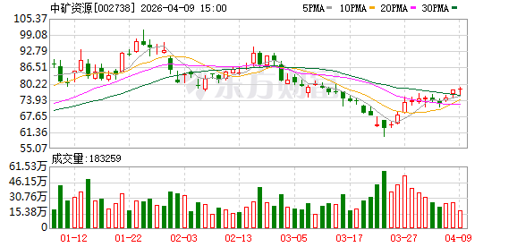
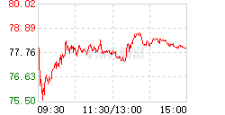

# 📊 中矿资源 (002738.SZ) 股票分析报告

> **分析时间：** 2026-04-09 | **当前股价：** 78.0元（+0.31%）| **市值：** ~562亿

---

## 一、📈 技术面分析

*图1：日K线图 — 近期走势*

*图2：分时图 — 今日走势*

### 1.1 走势概览

股价自2025年中低点27元附近持续上涨，2026年1月创出100.86元高点后回落整固，目前在75-79元区间震荡，4月9日上涨0.31%收于78元，逼近前期高点。

### 1.2 均线系统

| 均线 | 数值 | 状态 |
|------|------|------|
| MA5 | 75.24 | 向上 |
| MA20 | 72.09 | 向上 |
| MA60 | 81.0 | 向下 |
| MA5/MA20 | 交叉缠绕 | 中性 |

均线系统显示：**短期均线向上，中期均线向下，整体震荡格局**。

### 1.3 支撑与压力

| 类型 | 位置 | 意义 |
|------|------|------|
| 支撑1 | 75元（MA5） | 近期低点，需守住 |
| 支撑2 | 72元（MA20） | 中期支撑 |
| 压力1 | 78.69元 | 52周高点，需放量突破 |
| 压力2 | 81元（MA60） | 中期均线压力 |

### 1.4 今日分时解读

- **开盘：** 77.76元（前一日收盘）
- **最高：** 78.69元（涨1.2%，接近52周高点）
- **最低：** 77.76元
- **收盘：** 78.0元（+0.31%）
- **成交量：** 0.58倍均量，量能萎缩

### 1.5 关键技术信号

| 指标 | 数值 | 信号 |
|------|------|------|
| RSI | 55.8 | 中性（50上方偏多） |
| MACD | 动能增强 | DIF向上，红柱放大 |
| MA状态 | 交叉缠绕 | 震荡 |
| 量能 | 0.58倍 | 缩量，需补量确认 |

**技术面评级：** 🟡 中性偏强（MACD向好，但量能不足）

---

## 二、💰 基本面分析

### 2.1 核心财务数据

| 指标 | 数值 | 同比 |
|------|------|------|
| 市盈率 (PE) | 122.97 | 较高 |
| 市净率 (PB) | 4.62 | 中性 |
| 52周高点 | 78.69元 | 当前接近 |
| 52周低点 | 27.01元 | 已大涨190% |

### 2.2 2025年业绩

| 报告期 | 营收 | 同比 | 净利 | 同比 |
|--------|------|------|------|------|
| 2025全年 | 48.18亿 | +34.99% | 2.04亿 | -62.58% |
| 2025Q3 | 15.51亿 | +35.19% | 1.15亿 | +58.18% |

**关键点：** 营收增长但净利下滑，主要因锂价下跌压制盈利能力。

### 2.3 业务结构

中矿资源主营：
- **锂电新材料：** 碳酸锂、氢氧化锂
- **稀有金属：** 铯、铷（全球垄断优势）
- **地勘技术服务：** 传统业务

### 2.4 研报观点

最新券商评级（2026年4月）：
- **东吴证券：** 买入（机器人+航空航天打开增量空间）
- **华源证券：** 买入（毛利率持续改善，在手订单超千亿）
- **国信证券：** 增持（资源端和材料端持续突破）

**基本面评级：** 🟡 中性（营收增长、券商看好，但PE偏高、净利下滑）

---

## 三、💵 资金流向

| 日期 | 主力净流入 | 散户净流入 |
|------|-----------|-----------|
| 4月9日 | -4191万 | +1400万 |
| 趋势 | 连续净流出 | - |

**融资余额：** 31.77亿元（4月8日），环比+3.30%，融资客在加仓。

**资金面评级：** 🔴 偏弱（主力净流出，但融资余额上升）

---

## 四、📋 综合判断

### 多空对比

| 🟢 做多逻辑 | 🔴 做空逻辑 |
|-----------|-----------|
| 锂价修复，Q3净利大增58% | PE高达123，估值极贵 |
| 券商普遍买入评级 | 2025全年净利下滑62% |
| 融资余额持续增长 | 主力资金连续净流出 |
| 铯铷全球垄断，护城河深 | 52周高点附近，压力较大 |
| 机器人+航空航天新赛道 | 成交量萎缩，上涨动力不足 |

### 核心结论

**总评级：** 🟡 观望

**理由：**
1. 技术面MACD向好，但量能不足，突破需要补量
2. 基本面营收增长但净利下滑，PE极高（123倍）
3. 券商看好但目标价与现价差距大（历史目标价45-48元，当前78元已超预期）
4. 主力资金连续净流出，筹码分散

**操作建议：**
- **已持仓者：** 可持有，但需设78.69元止损，跌破75考虑减仓
- **观望者：** 暂不追高，等回踩72-75元支撑再考虑
- **短线者：** 78-79元区间高抛低吸，破75止损

---

## 五、⚠️ 风险提示

1. **锂价波动风险：** 公司盈利与锂价高度相关
2. **估值风险：** PE 123倍，股价已充分反映乐观预期
3. **解禁风险：** 需关注股东减持动态
4. **市场情绪：** 资源品周期波动大

---

*报告由雪子助手生成 | 数据来源：东方财富、券商研报*
