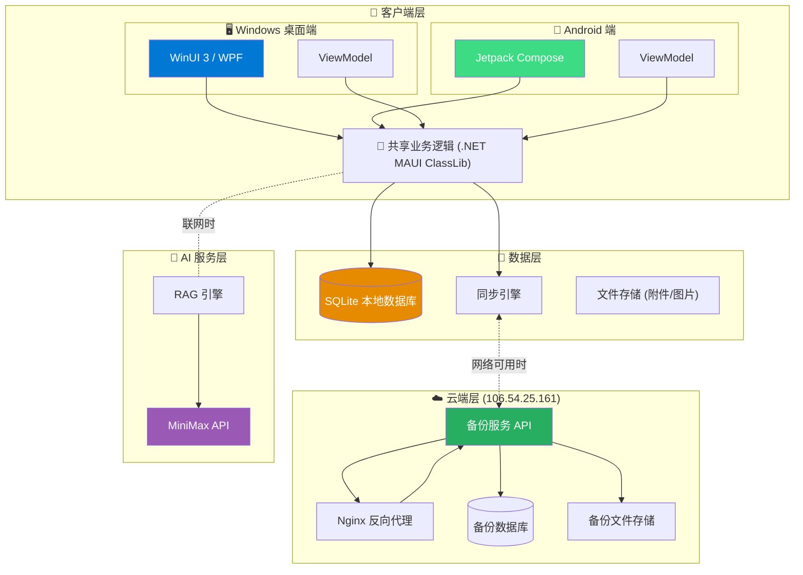
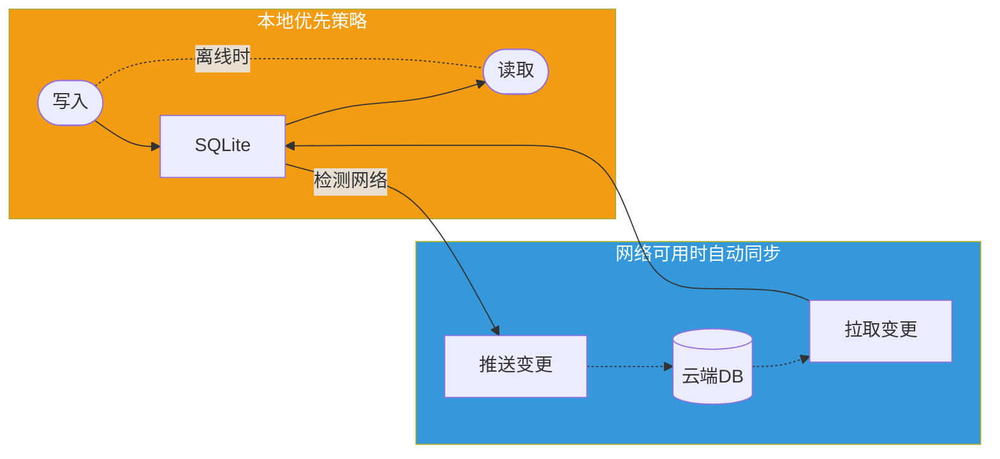
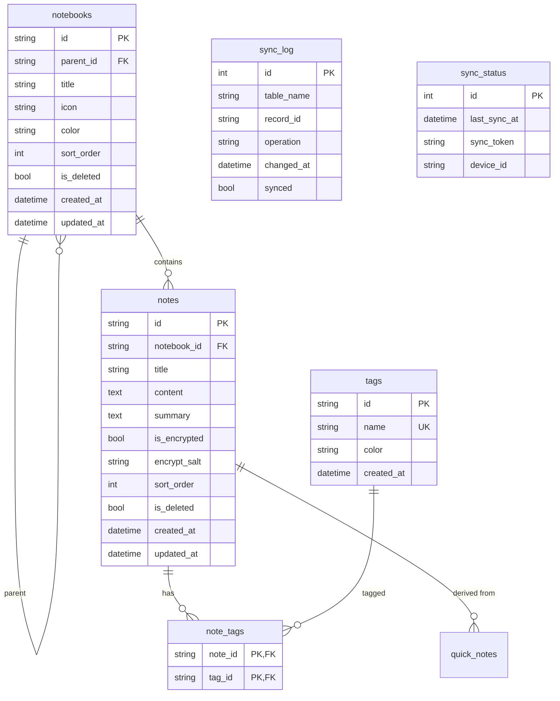
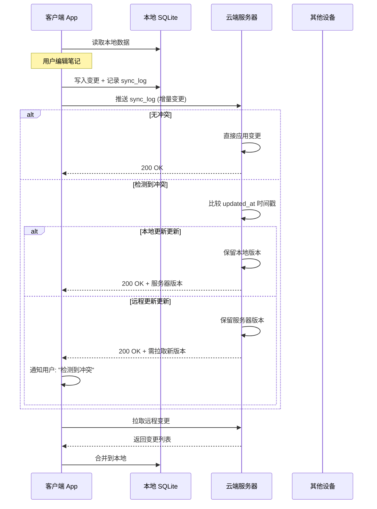

# 雪子知识库 (XueziKB) 架构设计 v5

> 文档版本：v5
> 作者：Opus (via CC)
> 日期：2026-04-04
> 状态：架构设计稿，待确认

---

## 1. 系统架构图





---

## 2. 技术选型

### 2.1 跨平台框架选型

| 维度 | 选项A (推荐) | 选项B | 选项C |
|------|-------------|-------|-------|
| **框架** | **.NET MAUI** | Flutter | Tauri + React |
| **语言** | C# | Dart | Rust + TS |
| **Windows UI** | WinUI 3 原生 | 自绘 | WebView2 |
| **Android UI** | 原生 Compose | 自绘 | WebView |
| **原生体验** | ⭐⭐⭐ | ⭐⭐⭐ | ⭐⭐ |
| **学习曲线** | 低 (C#) | 中 (Dart) | 高 (多语言) |
| **生态** | 成熟 .NET | 成熟 | 一般 |
| **代码共享** | 70%+ | 80%+ | 50% |
| **SQLite 支持** | 官方 EF Core + sqlite-net | sqflite | 需绑定 |
| **发布包大小** | ~30MB | ~15MB | ~10MB |
| **最终决定** | **✅ 推荐** | 备选 | 过于复杂 |

> **选择 .NET MAUI 的理由：**
> - 雪子熟悉 C#，学习成本最低
> - WinUI 3 提供真正的 Windows 原生体验
> - Jetpack Compose 提供 Android 原生体验
> - 70%+ 代码共享，业务逻辑完全复用
> - 成熟的 SQLite 支持（sqlite-net-pcl）
> - 无需维护多语言技术栈

### 2.2 详细技术栈

#### Windows 桌面端
| 组件 | 技术选型 | 说明 |
|------|---------|------|
| **UI 框架** | WinUI 3 | Windows 11 原生设计语言 Fluent UI |
| **窗口管理** | MAUI Window | 多窗口支持 |
| **导航** | MAUI Shell | 快速导航框架 |
| **响应式布局** | maui Blazor / XAML | 列表/详情布局 |

#### Android 手机端
| 组件 | 技术选型 | 说明 |
|------|---------|------|
| **UI 框架** | Jetpack Compose | Android 原生声明式 UI |
| **架构** | MVVM + Compose | 单向数据流 |
| **导航** | Navigation Compose | 页面导航 |
| **状态管理** | StateFlow / MutableState | 响应式状态 |

#### 共享代码 (.NET MAUI Class Library)
| 组件 | 技术选型 | 说明 |
|------|---------|------|
| **ORM** | sqlite-net-pcl | 轻量级 ORM |
| **DI** | Microsoft.Extensions.DependencyInjection | 依赖注入 |
| **网络** | System.Net.Http | HTTP 客户端 |
| **JSON** | System.Text.Json | 序列化 |
| **加密** | System.Security.Cryptography | AES 加密 |
| **日志** | Serilog | 结构化日志 |
| **同步** | 自研增量同步引擎 | CRDT 简化版 |

#### 云端服务
| 组件 | 技术选型 | 说明 |
|------|---------|------|
| **Web 服务器** | Nginx | 反向代理 + 静态文件 |
| **API 框架** | FastAPI (Python) | 轻量 API 服务 |
| **数据库** | SQLite (云端) | 备份存储 |
| **文件存储** | 本地文件系统 | 备份文件 |

---

## 3. 数据模型设计 (SQLite)

```sql
-- ============================================
-- 雪子知识库 v5 SQLite 数据模型
-- Phase 1 MVP 表结构
-- ============================================

-- 笔记本表 (树形结构)
CREATE TABLE notebooks (
    id TEXT PRIMARY KEY,              -- UUID
    parent_id TEXT,                   -- 父笔记本ID (NULL=根)
    title TEXT NOT NULL,              -- 笔记本名称
    icon TEXT DEFAULT '📁',           -- 图标 emoji
    color TEXT,                       -- 颜色主题
    sort_order INTEGER DEFAULT 0,     -- 排序
    is_deleted INTEGER DEFAULT 0,    -- 软删除
    created_at TEXT NOT NULL,         -- ISO8601
    updated_at TEXT NOT NULL,
    synced_at TEXT,                   -- 上次同步时间
    FOREIGN KEY (parent_id) REFERENCES notebooks(id)
);

-- 笔记表
CREATE TABLE notes (
    id TEXT PRIMARY KEY,
    notebook_id TEXT NOT NULL,
    title TEXT NOT NULL,
    content TEXT,                     -- Markdown 内容
    summary TEXT,                     -- 摘要/预览
    is_encrypted INTEGER DEFAULT 0,   -- 是否加密
    encrypt_salt TEXT,                -- 加密盐值
    sort_order INTEGER DEFAULT 0,
    is_deleted INTEGER DEFAULT 0,
    created_at TEXT NOT NULL,
    updated_at TEXT NOT NULL,
    synced_at TEXT,
    FOREIGN KEY (notebook_id) REFERENCES notebooks(id)
);

-- 标签表
CREATE TABLE tags (
    id TEXT PRIMARY KEY,
    name TEXT NOT NULL UNIQUE,
    color TEXT DEFAULT '#0078D4',
    created_at TEXT NOT NULL
);

-- 笔记-标签关联表 (多对多)
CREATE TABLE note_tags (
    note_id TEXT NOT NULL,
    tag_id TEXT NOT NULL,
    PRIMARY KEY (note_id, tag_id),
    FOREIGN KEY (note_id) REFERENCES notes(id) ON DELETE CASCADE,
    FOREIGN KEY (tag_id) REFERENCES tags(id) ON DELETE CASCADE
);

-- 同步日志表 (用于增量同步)
CREATE TABLE sync_log (
    id INTEGER PRIMARY KEY AUTOINCREMENT,
    table_name TEXT NOT NULL,
    record_id TEXT NOT NULL,
    operation TEXT NOT NULL,          -- INSERT/UPDATE/DELETE
    changed_at TEXT NOT NULL,
    synced INTEGER DEFAULT 0,         -- 是否已同步
    sync_version INTEGER DEFAULT 0    -- 同步版本号
);

-- 同步状态表
CREATE TABLE sync_status (
    id INTEGER PRIMARY KEY CHECK (id = 1),
    last_sync_at TEXT,
    sync_token TEXT,                  -- 冲突解决token
    device_id TEXT NOT NULL,
    sync_version INTEGER DEFAULT 0
);

-- 便签表 (快速记录)
CREATE TABLE quick_notes (
    id TEXT PRIMARY KEY,
    content TEXT NOT NULL,
    is_pinned INTEGER DEFAULT 0,
    created_at TEXT NOT NULL,
    updated_at TEXT NOT NULL,
    synced_at TEXT
);

-- ============================================
-- 索引优化
-- ============================================
CREATE INDEX idx_notes_notebook ON notes(notebook_id);
CREATE INDEX idx_notes_updated ON notes(updated_at);
CREATE INDEX idx_notes_deleted ON notes(is_deleted);
CREATE INDEX idx_notebooks_parent ON notebooks(parent_id);
CREATE INDEX idx_sync_log_synced ON sync_log(synced);
CREATE INDEX idx_sync_log_changed ON sync_log(changed_at);

-- ============================================
-- 触发器：自动更新 updated_at
-- ============================================
CREATE TRIGGER update_note_timestamp 
AFTER UPDATE ON notes
BEGIN
    UPDATE notes SET updated_at = datetime('now') WHERE id = NEW.id;
END;

CREATE TRIGGER update_notebook_timestamp 
AFTER UPDATE ON notebooks
BEGIN
    UPDATE notebooks SET updated_at = datetime('now') WHERE id = NEW.id;
END;

-- ============================================
-- 触发器：记录同步日志
-- ============================================
CREATE TRIGGER log_note_insert
AFTER INSERT ON notes
BEGIN
    INSERT INTO sync_log (table_name, record_id, operation, changed_at)
    VALUES ('notes', NEW.id, 'INSERT', datetime('now'));
END;

CREATE TRIGGER log_note_update
AFTER UPDATE ON notes
BEGIN
    INSERT INTO sync_log (table_name, record_id, operation, changed_at)
    VALUES ('notes', NEW.id, 'UPDATE', datetime('now'));
END;

CREATE TRIGGER log_note_delete
AFTER UPDATE ON notes
WHEN NEW.is_deleted = 1 AND OLD.is_deleted = 0
BEGIN
    INSERT INTO sync_log (table_name, record_id, operation, changed_at)
    VALUES ('notes', NEW.id, 'DELETE', datetime('now'));
END;

CREATE TRIGGER log_notebook_insert
AFTER INSERT ON notebooks
BEGIN
    INSERT INTO sync_log (table_name, record_id, operation, changed_at)
    VALUES ('notebooks', NEW.id, 'INSERT', datetime('now'));
END;

CREATE TRIGGER log_notebook_update
AFTER UPDATE ON notebooks
BEGIN
    INSERT INTO sync_log (table_name, record_id, operation, changed_at)
    VALUES ('notebooks', NEW.id, 'UPDATE', datetime('now'));
END;
```

### ER 图



---

## 4. 同步方案

### 4.1 同步策略：本地优先 + 增量同步

```
┌─────────────────────────────────────────────────────────────┐
│                      同步决策流程                             │
├─────────────────────────────────────────────────────────────┤
│  1. 应用启动                                                 │
│     ↓                                                        │
│  2. 检测网络状态                                              │
│     ├─ 有网络 → 触发同步 → 后台下载 → 合并 → 前台推送         │
│     └─ 无网络 → 完全本地可用 → 标记待同步 → 跳过              │
│                                                              │
│  3. 同步触发时机                                             │
│     ├─ App 启动 (后台异步)                                   │
│     ├─ 从后台恢复 (前台同步)                                 │
│     ├─ 手动下拉刷新                                          │
│     └─ 定时检查 (每 5 分钟)                                  │
└─────────────────────────────────────────────────────────────┘
```

### 4.2 冲突解决策略 (乐观锁 + Last-Write-Wins)



### 4.3 同步 API 设计

#### 云端服务器: `http://106.54.25.161:8080/api/v1/`

| 方法 | 路径 | 说明 | 请求体 | 响应体 |
|------|------|------|--------|--------|
| POST | `/sync/push` | 推送本地增量变更 | `{changes: [...]}` | `{success, serverVersion, conflicts}` |
| GET | `/sync/pull` | 拉取远程增量变更 | `?since={token}` | `{changes: [...], token}` |
| GET | `/sync/full` | 全量拉取 (首次同步) | `?deviceId={id}` | `{notebooks, notes, tags}` |
| POST | `/sync/register` | 注册设备 | `{deviceId, deviceName}` | `{token}` |
| POST | `/sync/ping` | 心跳保活 | `{}` | `{serverTime}` |

#### 变更数据结构:

```json
{
  "tableName": "notes",
  "recordId": "uuid-xxx",
  "operation": "UPDATE",
  "data": {
    "id": "uuid-xxx",
    "title": "新标题",
    "content": "...",
    "updatedAt": "2026-04-04T08:00:00Z"
  },
  "localVersion": 5,
  "timestamp": "2026-04-04T08:00:00Z"
}
```

### 4.4 文件同步

- 附件/图片: 存储在设备本地 `Documents/XueziKB/Attachments/`
- 上传时: `POST /sync/upload` → 返回 `fileId` → 关联到笔记
- 下载时: `GET /sync/download/{fileId}` → 写入本地

---

## 5. Phase 1 详细任务分解

### 5.1 任务总览

| # | 任务 | 优先级 | 预计时间 | 依赖 |
|---|------|--------|---------|------|
| 1 | 项目脚手架搭建 | P0 | 10分钟 | 无 |
| 2 | SQLite 数据层封装 | P0 | 10分钟 | 1 |
| 3 | 笔记本 CRUD | P0 | 10分钟 | 2 |
| 4 | 笔记 CRUD | P0 | 10分钟 | 2, 3 |
| 5 | 标签管理 | P1 | 10分钟 | 4 |
| 6 | 同步引擎核心 | P0 | 10分钟 | 2 |
| 7 | 云端备份 API | P0 | 10分钟 | 6 |
| 8 | Windows 端 UI | P0 | 10分钟 | 3, 4, 5 |
| 9 | Android 端 UI | P0 | 10分钟 | 3, 4, 5 |
| 10 | 联调测试 | P0 | 10分钟 | 7, 8, 9 |

### 5.2 详细任务说明

#### 任务 1: 项目脚手架搭建

**目标**: 创建完整的 .NET MAUI 解决方案结构

**目录结构**:
```
XueziKB/
├── XueziKB.sln                    # 解决方案文件
├── src/
│   ├── XueziKB.App/               # 主应用 (MAUI)
│   │   ├── App.xaml
│   │   ├── App.xaml.cs
│   │   ├── Platforms/
│   │   │   ├── Windows/           # WinUI 3 特定代码
│   │   │   └── Android/           # Android 特定代码
│   │   └── Views/                 # 页面
│   ├── XueziKB.Shared/            # 共享业务逻辑
│   │   ├── Models/                # 数据模型
│   │   ├── Services/              # 业务服务
│   │   ├── ViewModels/            # ViewModels
│   │   └── Database/             # SQLite 封装
│   └── XueziKB.CloudApi/          # 云端 API (Python FastAPI)
│       ├── main.py
│       ├── sync.py
│       └── requirements.txt
└── tests/
    └── XueziKB.Tests/             # 单元测试
```

**验收标准**:
- [ ] `dotnet build` 成功
- [ ] Windows 项目启动
- [ ] Android 项目构建

---

#### 任务 2: SQLite 数据层封装

**目标**: 封装通用的 SQLite 操作层

**核心类**:

```csharp
// DatabaseService.cs
public class DatabaseService
{
    private SQLiteAsyncConnection _db;
    
    public Task InitializeAsync();
    public Task<List<T>> GetAllAsync<T>() where T : new();
    public Task<T> GetByIdAsync<T>(string id) where T : new();
    public Task<int> InsertAsync<T>(T entity);
    public Task<int> UpdateAsync<T>(T entity);
    public Task<int> DeleteAsync<T>(string id);
    public Task<List<T>> QueryAsync<T>(string sql, params object[] args);
}
```

**验收标准**:
- [ ] 数据库初始化成功
- [ ] CRUD 操作正常
- [ ] 触发器正常记录 sync_log

---

#### 任务 3: 笔记本 CRUD

**目标**: 实现笔记本的创建、读取、更新、删除

**功能点**:
1. 创建笔记本（支持嵌套）
2. 查看笔记本列表（树形）
3. 编辑笔记本名称/图标/颜色
4. 删除笔记本（软删除，级联笔记）
5. 拖拽排序

**ViewModel**:

```csharp
public class NotebookViewModel
{
    public ObservableCollection<Notebook> Notebooks { get; }
    
    public Task CreateNotebookAsync(string title, string parentId = null);
    public Task UpdateNotebookAsync(Notebook notebook);
    public Task DeleteNotebookAsync(string id);
    public Task MoveNotebookAsync(string id, string newParentId);
}
```

**验收标准**:
- [ ] 创建笔记本成功
- [ ] 树形列表显示正确
- [ ] 删除后笔记保留

---

#### 任务 4: 笔记 CRUD

**目标**: 实现笔记的创建、读取、更新、删除

**功能点**:
1. 创建笔记（Markdown 编辑器）
2. 查看笔记列表（按笔记本筛选）
3. 编辑笔记（标题 + 内容）
4. 删除笔记（软删除）
5. 搜索笔记（标题 + 内容）

**ViewModel**:

```csharp
public class NoteViewModel
{
    public ObservableCollection<Note> Notes { get; }
    public Note CurrentNote { get; set; }
    
    public Task<List<Note>> GetNotesAsync(string notebookId);
    public Task CreateNoteAsync(string notebookId, string title, string content);
    public Task UpdateNoteAsync(Note note);
    public Task DeleteNoteAsync(string id);
    public Task<List<Note>> SearchNotesAsync(string query);
}
```

**验收标准**:
- [ ] 笔记创建成功
- [ ] Markdown 编辑器正常
- [ ] 搜索返回正确结果

---

#### 任务 5: 标签管理

**目标**: 实现标签的创建、关联、筛选

**功能点**:
1. 创建标签（名称 + 颜色）
2. 为笔记添加/移除标签
3. 按标签筛选笔记
4. 标签列表管理

**ViewModel**:

```csharp
public class TagViewModel
{
    public ObservableCollection<Tag> Tags { get; }
    
    public Task<List<Tag>> GetTagsAsync();
    public Task CreateTagAsync(string name, string color);
    public Task AddTagToNoteAsync(string noteId, string tagId);
    public Task RemoveTagFromNoteAsync(string noteId, string tagId);
    public Task<List<Note>> GetNotesByTagAsync(string tagId);
}
```

**验收标准**:
- [ ] 标签创建成功
- [ ] 笔记可关联多个标签
- [ ] 筛选功能正常

---

#### 任务 6: 同步引擎核心

**目标**: 实现本地优先的增量同步引擎

**核心逻辑**:

```csharp
public class SyncEngine
{
    private readonly DatabaseService _db;
    private readonly CloudApiClient _api;
    private readonly NetworkMonitor _network;
    
    // 核心同步循环
    public async Task SyncAsync()
    {
        if (!await _network.IsAvailableAsync()) return;
        
        // 1. 推：上传本地 pending 变更
        await PushPendingChangesAsync();
        
        // 2. 拉：拉取服务器变更
        await PullServerChangesAsync();
        
        // 3. 处理冲突
        await ResolveConflictsAsync();
    }
    
    // 推送本地变更
    private async Task PushPendingChangesAsync()
    {
        var pending = await _db.GetPendingChangesAsync();
        foreach (var change in pending)
        {
            var result = await _api.PushChangeAsync(change);
            if (result.Success)
                await _db.MarkAsSyncedAsync(change);
            else if (result.HasConflict)
                await _db.CreateConflictAsync(change, result.ServerData);
        }
    }
    
    // 拉取远程变更
    private async Task PullServerChangesAsync()
    {
        var lastToken = await _db.GetLastSyncTokenAsync();
        var changes = await _api.PullChangesAsync(lastToken);
        
        foreach (var change in changes)
            await _db.ApplyChangeAsync(change);
        
        await _db.UpdateSyncTokenAsync(changes.NewToken);
    }
}
```

**验收标准**:
- [ ] 离线时完全可用
- [ ] 联网时自动同步
- [ ] 冲突正确检测

---

#### 任务 7: 云端备份 API

**目标**: 在腾讯云部署同步 API

**技术选型**: Python FastAPI + SQLite

**API 端点**:

```python
# main.py
from fastapi import FastAPI
from pydantic import BaseModel
from typing import List, Optional
import sqlite3
from datetime import datetime

app = FastAPI()
DB_PATH = "/opt/xuezi-kb/sync.db"

# === 设备注册 ===
@app.post("/api/v1/sync/register")
async def register_device(device_id: str, device_name: str):
    """注册设备，获取访问令牌"""
    conn = sqlite3.connect(DB_PATH)
    cursor = conn.cursor()
    cursor.execute("""
        INSERT OR REPLACE INTO devices (id, name, registered_at)
        VALUES (?, ?, ?)
    """, (device_id, device_name, datetime.utcnow().isoformat()))
    conn.commit()
    conn.close()
    return {"token": f"token_{device_id}"}

# === 推送变更 ===
@app.post("/api/v1/sync/push")
async def push_changes(token: str, changes: List[Change]):
    """接收客户端推送的增量变更"""
    # 验证 token
    # 应用变更到数据库
    # 返回冲突列表
    pass

# === 拉取变更 ===
@app.get("/api/v1/sync/pull")
async def pull_changes(token: str, since: Optional[str] = None):
    """拉取自指定版本以来的所有变更"""
    # 查询变更
    # 返回变更列表和新 token
    pass

# === 全量拉取 ===
@app.get("/api/v1/sync/full")
async def full_sync(token: str, device_id: str):
    """首次同步时全量拉取"""
    # 返回所有数据
    pass
```

**部署**:
```bash
# 在腾讯云服务器上
mkdir -p /opt/xuezi-kb
cd /opt/xuezi-kb

# 启动服务
nohup python3 -m uvicorn main:app --host 0.0.0.0 --port 8080 &
```

**验收标准**:
- [ ] API 正常响应
- [ ] 数据正确存储
- [ ] 设备注册成功

---

#### 任务 8: Windows 端 UI

**目标**: 实现 Windows 原生 UI

**页面结构**:
```
Views/
├── MainWindow.xaml           # 主窗口
├── HomePage.xaml             # 首页（笔记本列表）
├── NoteListPage.xaml         # 笔记列表
├── NoteEditorPage.xaml       # 笔记编辑器
├── TagManagementPage.xaml     # 标签管理
└── SettingsPage.xaml         # 设置页
```

**主窗口布局**:
```
┌────────────────────────────────────────────────────────────┐
│  雪子知识库                              [_] [□] [X]      │
├─────────────┬──────────────────────────────────────────────┤
│             │                                              │
│  📁 笔记本   │   标题: _______________                     │
│  ├─ 工作     │   ________________________________          │
│  │  ├─ 项目A  │   ________________________________          │
│  │  └─ 项目B  │   ________________________________          │
│  ├─ 生活     │   ________________________________          │
│  └─ 学习     │                                              │
│             │   [保存] [删除]                               │
│  🏷️ 标签     │                                              │
│  ├─ #工作    │   标签: [🏷️工作] [+添加]                   │
│  ├─ #重要    │                                              │
│  └─ #待办    │                                              │
│             │                                              │
├─────────────┴──────────────────────────────────────────────┤
│  ☁ 已同步  |  最后同步: 2026-04-04 08:00                   │
└────────────────────────────────────────────────────────────┘
```

**验收标准**:
- [ ] WinUI 3 原生外观
- [ ] 侧边栏导航正常
- [ ] 笔记编辑流畅

---

#### 任务 9: Android 端 UI

**目标**: 实现 Android 原生 UI

**页面结构**:
```
com/xuezikb/app/
├── MainActivity.kt           # 主界面
├── HomeScreen.kt             # 首页
├── NoteListScreen.kt         # 笔记列表
├── NoteEditorScreen.kt        # 笔记编辑器
└── SettingsScreen.kt         # 设置
```

**主界面布局**:
```
┌─────────────────────────────┐
│ ☰  雪子知识库           🔍 │
├─────────────────────────────┤
│                             │
│  📁 工作                    │
│  📁 生活                    │
│  📁 学习                    │
│                             │
│  ─────────────────────────  │
│                             │
│  🏷️ 标签                    │
│  #工作  #重要  #待办        │
│                             │
│                             │
├─────────────────────────────┤
│  ☁ 已同步          ⚙️ 设置 │
└─────────────────────────────┘
```

**验收标准**:
- [ ] Material Design 3 外观
- [ ] 底部导航正常
- [ ] 触控编辑流畅

---

#### 任务 10: 联调测试

**目标**: 端到端测试完整流程

**测试场景**:
1. **离线创建**: 断网创建笔记 → 联网后自动同步
2. **冲突检测**: 两台设备同时编辑 → 检测到冲突
3. **数据完整性**: 卸载重装 → 数据从云端恢复
4. **性能测试**: 1000+ 笔记 → 搜索和同步性能可接受

**验收标准**:
- [ ] 离线创建笔记成功
- [ ] 联网后自动同步
- [ ] 云端数据正确
- [ ] 多设备数据一致

---

## 6. 后续功能路线图

### Phase 1 (当前): MVP
- ✅ 笔记本 CRUD
- ✅ 笔记 CRUD
- ✅ 标签管理
- ✅ 本地存储
- ✅ 云端备份

### Phase 2: 增强功能
- 📋 知识图谱（节点 + 关系可视化）
- 📋 日程管理 + 飞书推送
- 📋 AI RAG 问答
- 📋 文件预览（PDF/Word/Excel）
- 📋 思维导图

### Phase 3: 体验优化
- 📋 加密笔记
- 📋 模板系统
- 📋 导入导出
- 📋 深色主题

---

## 7. 风险与对策

| 风险 | 概率 | 影响 | 对策 |
|------|------|------|------|
| .NET MAUI Windows 支持不完善 | 中 | 高 | 备选: WinUI 3 独立项目 |
| 同步冲突处理复杂 | 高 | 中 | Phase 1 先做简单 LWW，后续迭代 |
| Android 权限问题 | 低 | 低 | 请求存储/通知权限时引导用户 |
| 服务器磁盘空间 | 低 | 中 | 定期清理旧版本，保留最近30天 |

---

*架构设计完成，待雪子确认后启动开发*
