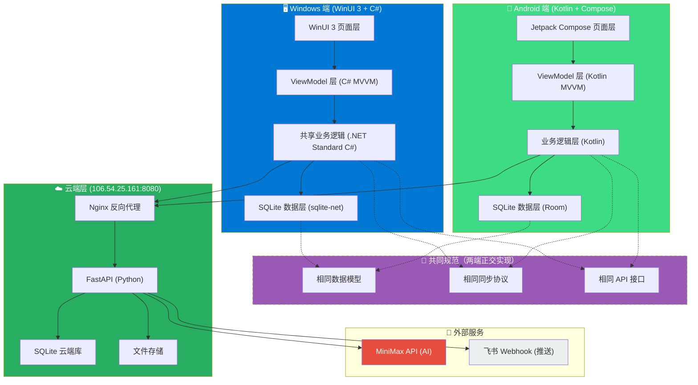
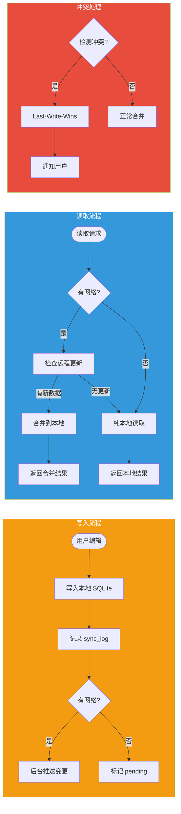
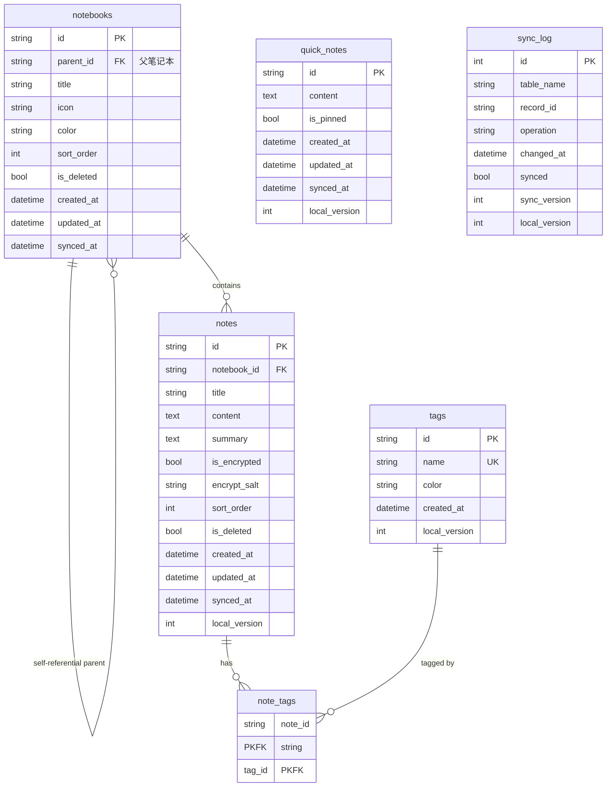
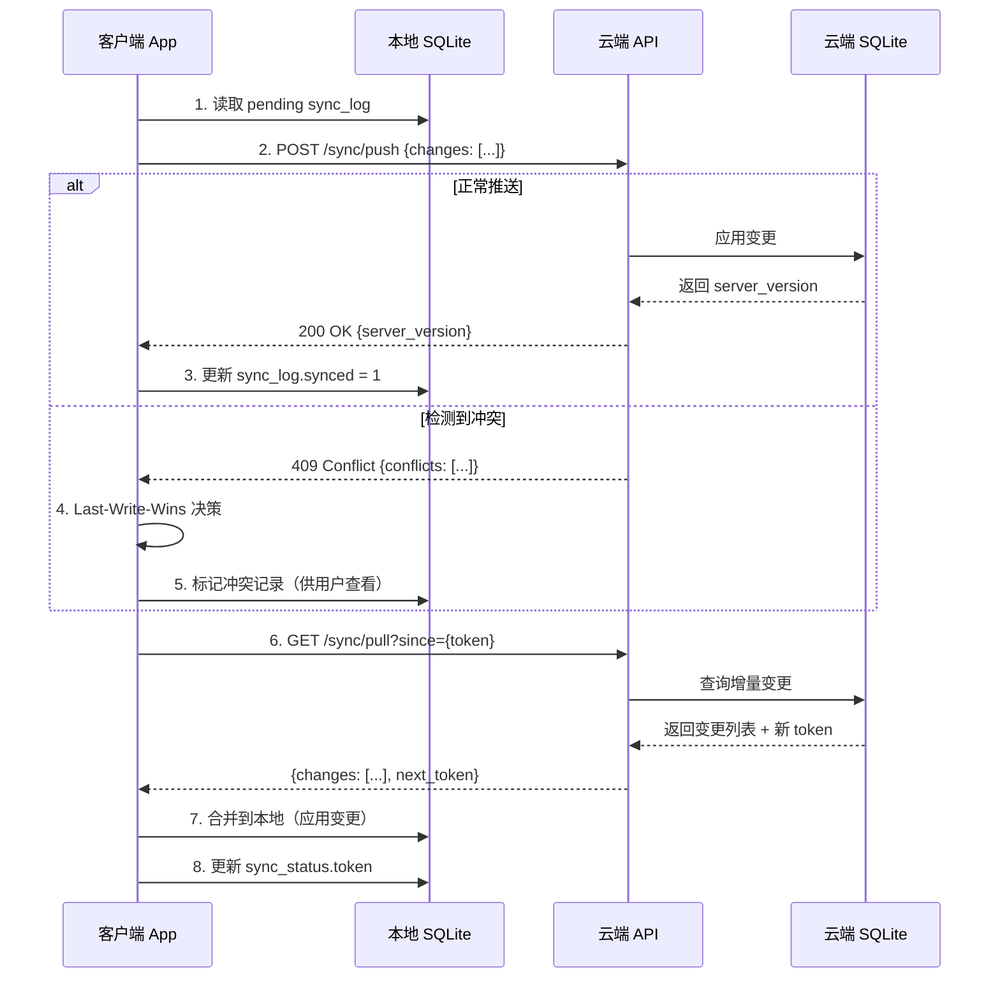

# 雪子知识库 (XueziKB) 架构设计 v6

> 文档版本：v6
> 作者：雪子助手
> 日期：2026-04-04
> 状态：架构设计稿，待确认

---

## 📌 v5 → v6 变更说明

| 项目 | v5 | v6（本次更新） | 变更原因 |
|------|-----|----------------|---------|
| **Windows 技术栈** | .NET MAUI (WinUI 3) | **WinUI 3 + C# 独立项目** | MAUI 对 Windows 桌面支持不成熟，独立项目更稳定 |
| **Android 技术栈** | .NET MAUI (Compose) | **Android Studio + Kotlin + Jetpack Compose** | 脱离 MAUI，使用原生稳定技术栈 |
| **共享类库** | .NET MAUI Class Library | **.NET Standard Library (C#核心)** | 仅 Windows 端直接引用，Android 端等价实现 |
| **代码共享方式** | MAUI 跨平台 | **相同数据模型 + 相同 API 协议** | Android 用 Kotlin 重写业务逻辑，但数据结构完全一致 |
| **同步引擎位置** | 共享层 | **各端独立实现（协议相同）** | 由于平台语言不同，同步引擎在各端独立，但协议完全一致 |

---

## 1. 系统架构图

### 1.1 整体架构



### 1.2 本地优先 + 同步流程



---

## 2. 项目结构

### 2.1 整体目录

```
XueziKB/
├── xuezi-kb-windows/           # Windows 端（WinUI 3 + C#）
├── xuezi-kb-android/           # Android 端（Kotlin + Compose）
├── xuezi-kb-shared/            # 共享类库（.NET Standard C#）
├── xuezi-kb-cloud/             # 云端 API（Python FastAPI）
└── docs/                       # 文档
```

### 2.2 Windows 端结构 (xuezi-kb-windows)

```
xuezi-kb-windows/
├── XueziKB.Windows.sln
├── XueziKB.Windows/
│   ├── App.xaml
│   ├── App.xaml.cs
│   ├── MainWindow.xaml
│   ├── MainWindow.xaml.cs
│   ├── ViewModels/              # ViewModel 层
│   │   ├── MainViewModel.cs
│   │   ├── NotebookViewModel.cs
│   │   ├── NoteEditorViewModel.cs
│   │   └── SettingsViewModel.cs
│   ├── Views/                  # 页面
│   │   ├── HomePage.xaml
│   │   ├── NoteListPage.xaml
│   │   ├── NoteEditorPage.xaml
│   │   └── SettingsPage.xaml
│   ├── Controls/               # 自定义控件
│   │   └── MarkdownEditor.xaml
│   ├── Services/               # 平台特定服务
│   │   └── WindowsFileService.cs
│   ├── Assets/                 # 资源文件
│   └── Package.appxmanifest
└── XueziKB.Windows.csproj
```

**直接引用**: `xuezi-kb-shared` (.NET Standard DLL)

### 2.3 Android 端结构 (xuezi-kb-android)

```
xuezi-kb-android/
├── app/
│   └── src/main/
│       ├── java/com/xuezikb/app/
│       │   ├── MainActivity.kt
│       │   ├── ui/
│       │   │   ├── theme/
│       │   │   │   └── Theme.kt
│       │   │   ├── home/
│       │   │   │   └── HomeScreen.kt
│       │   │   ├── notelist/
│       │   │   │   └── NoteListScreen.kt
│       │   │   ├── editor/
│       │   │   │   └── NoteEditorScreen.kt
│       │   │   └── settings/
│       │   │       └── SettingsScreen.kt
│       │   ├── viewmodel/
│       │   │   ├── HomeViewModel.kt
│       │   │   ├── NoteListViewModel.kt
│       │   │   └── NoteEditorViewModel.kt
│       │   ├── data/
│       │   │   ├── local/
│       │   │   │   ├── AppDatabase.kt      # Room 数据库
│       │   │   │   ├── NoteDao.kt
│       │   │   │   ├── NotebookDao.kt
│       │   │   │   └── TagDao.kt
│       │   │   └── remote/
│       │   │       └── SyncApiClient.kt    # HTTP 同步客户端
│       │   ├── domain/                     # 业务逻辑（与共享库等价）
│       │   │   ├── model/                  # 数据模型（与共享库相同 schema）
│       │   │   ├── repository/
│       │   │   │   ├── NoteRepository.kt
│       │   │   │   └── SyncRepository.kt
│       │   │   └── usecase/
│       │   │       ├── CreateNoteUseCase.kt
│       │   │       └── SyncUseCase.kt
│       │   └── XueziKBApp.kt               # Application 类
│       └── res/
│           └── ...
└── build.gradle.kts
```

**独立实现**: 业务逻辑、数据层完全用 Kotlin 重新实现，但 **schema 和同步协议与 Windows 端完全一致**。

### 2.4 共享类库结构 (xuezi-kb-shared)

```
xuezi-kb-shared/
├── XueziKB.Shared.sln
├── src/
│   └── XueziKB.Shared.Core/
│       ├── Models/                  # 数据模型（Windows/Android 共用 schema）
│       │   ├── Note.cs
│       │   ├── Notebook.cs
│       │   ├── Tag.cs
│       │   ├── NoteTag.cs
│       │   ├── SyncLog.cs
│       │   └── SyncStatus.cs
│       ├── Services/                 # 核心业务服务
│       │   ├── INoteService.cs
│       │   ├── NoteService.cs
│       │   ├── INotebookService.cs
│       │   ├── NotebookService.cs
│       │   ├── ITagService.cs
│       │   └── TagService.cs
│       ├── Sync/                     # 同步引擎核心
│       │   ├── ISyncEngine.cs
│       │   ├── SyncEngine.cs
│       │   ├── SyncChange.cs
│       │   ├── ConflictResolver.cs
│       │   └── SyncApiClient.cs      # HTTP 客户端
│       ├── Database/                 # SQLite 封装
│       │   ├── IDatabaseService.cs
│       │   └── DatabaseService.cs    # sqlite-net 实现
│       ├── Crypto/                   # 加密工具
│       │   └── AesCrypto.cs
│       ├── Extensions/
│       │   └── DateTimeExtensions.cs
│       └── XueziKB.Shared.Core.csproj
└── tests/
    └── XueziKB.Shared.Core.Tests/
```

**仅供 Windows 端引用**。Android 端等价实现 Kotlin 版本。

### 2.5 云端结构 (xuezi-kb-cloud)

```
xuezi-kb-cloud/
├── main.py                     # FastAPI 入口
├── requirements.txt
├── sync/
│   ├── __init__.py
│   ├── router.py              # 同步路由
│   ├── models.py             # Pydantic 模型
│   ├── service.py            # 同步业务逻辑
│   └── db.py                 # SQLite 操作
├── notes/
│   ├── __init__.py
│   ├── router.py
│   └── service.py
└── auth/
    ├── __init__.py
    └── service.py
```

---

## 3. 数据模型（SQLite）

> **核心原则**：Windows 端和 Android 端使用完全相同的数据库 schema，确保同步无歧义。

### 3.1 完整表结构

```sql
-- ============================================
-- 雪子知识库 v6 SQLite 数据模型
-- Windows 端 & Android 端共用同一 schema
-- ============================================

-- 笔记本表（树形结构，支持无限嵌套）
CREATE TABLE notebooks (
    id TEXT PRIMARY KEY,              -- UUID v4
    parent_id TEXT,                   -- 父笔记本 ID（NULL = 根）
    title TEXT NOT NULL,              -- 笔记本名称
    icon TEXT DEFAULT '📁',           -- 图标 emoji
    color TEXT DEFAULT '#0078D4',     -- 颜色（HEX）
    sort_order INTEGER DEFAULT 0,    -- 排序序号
    is_deleted INTEGER DEFAULT 0,    -- 软删除（0=正常, 1=已删除）
    created_at TEXT NOT NULL,         -- ISO8601 UTC
    updated_at TEXT NOT NULL,         -- ISO8601 UTC
    synced_at TEXT,                   -- 上次同步时间（NULL = 从未同步）
    FOREIGN KEY (parent_id) REFERENCES notebooks(id) ON DELETE SET NULL
);

-- 笔记表
CREATE TABLE notes (
    id TEXT PRIMARY KEY,              -- UUID v4
    notebook_id TEXT NOT NULL,         -- 所属笔记本
    title TEXT NOT NULL,               -- 标题
    content TEXT DEFAULT '',           -- Markdown 内容
    summary TEXT DEFAULT '',           -- 摘要（前 200 字符，供搜索预览用）
    is_encrypted INTEGER DEFAULT 0,   -- 是否加密（0=否, 1=是）
    encrypt_salt TEXT,                 -- AES 加密盐值（加密时必填）
    sort_order INTEGER DEFAULT 0,      -- 排序序号
    is_deleted INTEGER DEFAULT 0,      -- 软删除
    created_at TEXT NOT NULL,          -- ISO8601 UTC
    updated_at TEXT NOT NULL,          -- ISO8601 UTC
    synced_at TEXT,                   -- 上次同步时间
    FOREIGN KEY (notebook_id) REFERENCES notebooks(id) ON DELETE CASCADE
);

-- 标签表
CREATE TABLE tags (
    id TEXT PRIMARY KEY,              -- UUID v4
    name TEXT NOT NULL UNIQUE,        -- 标签名（全局唯一）
    color TEXT DEFAULT '#0078D4',     -- 标签颜色（HEX）
    created_at TEXT NOT NULL
);

-- 笔记-标签关联表（多对多）
CREATE TABLE note_tags (
    note_id TEXT NOT NULL,
    tag_id TEXT NOT NULL,
    PRIMARY KEY (note_id, tag_id),
    FOREIGN KEY (note_id) REFERENCES notes(id) ON DELETE CASCADE,
    FOREIGN KEY (tag_id) REFERENCES tags(id) ON DELETE CASCADE
);

-- 同步日志表（用于增量同步，核心表）
CREATE TABLE sync_log (
    id INTEGER PRIMARY KEY AUTOINCREMENT,
    table_name TEXT NOT NULL,         -- 表名：notes/notebooks/tags/note_tags
    record_id TEXT NOT NULL,          -- 记录 ID
    operation TEXT NOT NULL,          -- 操作类型：INSERT/UPDATE/DELETE
    changed_at TEXT NOT NULL,         -- 变更时间（ISO8601 UTC）
    synced INTEGER DEFAULT 0,         -- 是否已同步到云端（0=pending, 1=synced）
    sync_version INTEGER DEFAULT 0,   -- 同步版本号（递增）
    local_version INTEGER DEFAULT 0   -- 本地版本号（用于冲突检测）
);

-- 同步状态表（设备级别）
CREATE TABLE sync_status (
    id INTEGER PRIMARY KEY CHECK (id = 1),
    last_sync_at TEXT,                 -- 上次完整同步时间
    sync_token TEXT,                   -- 当前同步 token（用于增量拉取起点）
    device_id TEXT NOT NULL UNIQUE,    -- 设备唯一 ID
    sync_version INTEGER DEFAULT 0     -- 全局同步版本
);

-- 便签表（快速随手记）
CREATE TABLE quick_notes (
    id TEXT PRIMARY KEY,              -- UUID v4
    content TEXT NOT NULL,            -- 便签内容
    is_pinned INTEGER DEFAULT 0,      -- 是否置顶
    created_at TEXT NOT NULL,
    updated_at TEXT NOT NULL,
    synced_at TEXT
);

-- ============================================
-- 索引
-- ============================================
CREATE INDEX idx_notes_notebook ON notes(notebook_id);
CREATE INDEX idx_notes_updated ON notes(updated_at);
CREATE INDEX idx_notes_deleted ON notes(is_deleted);
CREATE INDEX idx_notebooks_parent ON notebooks(parent_id);
CREATE INDEX idx_notebooks_deleted ON notebooks(is_deleted);
CREATE INDEX idx_sync_log_synced ON sync_log(synced);
CREATE INDEX idx_sync_log_changed ON sync_log(changed_at);
CREATE INDEX idx_sync_log_table ON sync_log(table_name, record_id);

-- ============================================
-- 触发器：自动更新 updated_at
-- ============================================
CREATE TRIGGER trg_notes_updated
AFTER UPDATE ON notes
WHEN OLD.updated_at = NEW.updated_at  -- 防止递归触发
BEGIN
    UPDATE notes SET updated_at = datetime('now', 'utc') WHERE id = NEW.id;
END;

CREATE TRIGGER trg_notebooks_updated
AFTER UPDATE ON notebooks
WHEN OLD.updated_at = NEW.updated_at
BEGIN
    UPDATE notebooks SET updated_at = datetime('now', 'utc') WHERE id = NEW.id;
END;

-- ============================================
-- 触发器：记录 sync_log（增删改）
-- ============================================
-- notes INSERT
CREATE TRIGGER trg_notes_insert
AFTER INSERT ON notes
BEGIN
    INSERT INTO sync_log (table_name, record_id, operation, changed_at, synced, local_version)
    VALUES ('notes', NEW.id, 'INSERT', datetime('now', 'utc'), 0, 1);
END;

-- notes UPDATE
CREATE TRIGGER trg_notes_update
AFTER UPDATE ON notes
BEGIN
    INSERT INTO sync_log (table_name, record_id, operation, changed_at, synced, local_version)
    VALUES ('notes', NEW.id, 'UPDATE', datetime('now', 'utc'), 0, OLD.local_version + 1);
END;

-- notes DELETE（软删除时记录）
CREATE TRIGGER trg_notes_soft_delete
AFTER UPDATE ON notes
WHEN NEW.is_deleted = 1 AND OLD.is_deleted = 0
BEGIN
    INSERT INTO sync_log (table_name, record_id, operation, changed_at, synced, local_version)
    VALUES ('notes', NEW.id, 'DELETE', datetime('now', 'utc'), 0, OLD.local_version);
END;

-- notebooks INSERT
CREATE TRIGGER trg_notebooks_insert
AFTER INSERT ON notebooks
BEGIN
    INSERT INTO sync_log (table_name, record_id, operation, changed_at, synced, local_version)
    VALUES ('notebooks', NEW.id, 'INSERT', datetime('now', 'utc'), 0, 1);
END;

-- notebooks UPDATE
CREATE TRIGGER trg_notebooks_update
AFTER UPDATE ON notebooks
BEGIN
    INSERT INTO sync_log (table_name, record_id, operation, changed_at, synced, local_version)
    VALUES ('notebooks', NEW.id, 'UPDATE', datetime('now', 'utc'), 0, OLD.local_version + 1);
END;

-- tags INSERT
CREATE TRIGGER trg_tags_insert
AFTER INSERT ON tags
BEGIN
    INSERT INTO sync_log (table_name, record_id, operation, changed_at, synced, local_version)
    VALUES ('tags', NEW.id, 'INSERT', datetime('now', 'utc'), 0, 1);
END;

-- tags UPDATE
CREATE TRIGGER trg_tags_update
AFTER UPDATE ON tags
BEGIN
    INSERT INTO sync_log (table_name, record_id, operation, changed_at, synced, local_version)
    VALUES ('tags', NEW.id, 'UPDATE', datetime('now', 'utc'), 0, OLD.local_version + 1);
END;

-- note_tags INSERT
CREATE TRIGGER trg_note_tags_insert
AFTER INSERT ON note_tags
BEGIN
    INSERT INTO sync_log (table_name, record_id, operation, changed_at, synced, local_version)
    VALUES ('note_tags', NEW.id, 'INSERT', datetime('now', 'utc'), 0, 1);
END;

-- note_tags DELETE
CREATE TRIGGER trg_note_tags_delete
AFTER DELETE ON note_tags
BEGIN
    INSERT INTO sync_log (table_name, record_id, operation, changed_at, synced, local_version)
    VALUES ('note_tags', NEW.id, 'DELETE', datetime('now', 'utc'), 0, 0);
END;

-- quick_notes INSERT
CREATE TRIGGER trg_quick_notes_insert
AFTER INSERT ON quick_notes
BEGIN
    INSERT INTO sync_log (table_name, record_id, operation, changed_at, synced, local_version)
    VALUES ('quick_notes', NEW.id, 'INSERT', datetime('now', 'utc'), 0, 1);
END;

-- quick_notes UPDATE
CREATE TRIGGER trg_quick_notes_update
AFTER UPDATE ON quick_notes
BEGIN
    INSERT INTO sync_log (table_name, record_id, operation, changed_at, synced, local_version)
    VALUES ('quick_notes', NEW.id, 'UPDATE', datetime('now', 'utc'), 0, OLD.local_version + 1);
END;
```

### 3.2 ER 关系图



---

## 4. 同步方案

### 4.1 同步策略总览

```
┌────────────────────────────────────────────────────────────────┐
│                      同步触发时机                                 │
├────────────────────────────────────────────────────────────────┤
│  触发条件              │  同步方式    │  说明                    │
│  ─────────────────────┼────────────┼─────────────────────    │
│  App 启动              │  后台异步   │  不阻塞 UI，等待完成      │
│  从后台恢复前台         │  前台同步   │  立即同步，用户可见进度    │
│  手动下拉刷新          │  前台同步   │  用户主动触发             │
│  网络恢复连接          │  后台异步   │  监听到 network change   │
│  定时检查（每 5 分钟）  │  后台异步   │  仅在有 pending 时触发    │
└────────────────────────────────────────────────────────────────┘
```

### 4.2 增量同步流程



### 4.3 冲突解决策略

**规则：Last-Write-Wins (LWW) + 用户知情**

```python
def resolve_conflict(local_record, server_record, local_change, server_change):
    """
    冲突解决：比较 updated_at 时间戳
    - 较新者胜出
    - 较旧者的数据存入 conflict_reserve 表（保留 30 天）
    - 通知用户："检测到冲突，已自动解决"
    """
    if local_change.changed_at > server_change.changed_at:
        # 本地更新更新
        return ConflictResolution(winner="local", loser_data=server_record)
    else:
        # 服务器更新更新
        return ConflictResolution(winner="server", loser_data=local_record)
```

**冲突保留表（云端）**：

```sql
CREATE TABLE conflict_reserve (
    id INTEGER PRIMARY KEY AUTOINCREMENT,
    table_name TEXT NOT NULL,
    record_id TEXT NOT NULL,
    local_data TEXT NOT NULL,         -- JSON
    server_data TEXT NOT NULL,        -- JSON
    resolved_at TEXT NOT NULL,        -- 解决时间
    winner TEXT NOT NULL,             -- 'local' or 'server'
    device_id TEXT,                   -- 冲突来源设备
    expired_at TEXT NOT NULL          -- 过期时间（resolved_at + 30 天）
);
```

### 4.4 首次同步（全量拉取）

```
┌─────────────────────────────────────────────────────────────┐
│  首次同步流程                                               │
├─────────────────────────────────────────────────────────────┤
│  1. App 生成 device_id（UUID，稳定存储）                   │
│  2. POST /sync/register {device_id, device_name}           │
│  3. 服务端创建设备记录，返回 access_token                   │
│  4. GET /sync/full?device_id={id}                           │
│  5. 服务端返回所有数据（notebooks + notes + tags）          │
│  6. App 清空本地数据（可选，取决于策略）                    │
│  7. App 按顺序写入本地：notebooks → notes → tags           │
│  8. App 记录 sync_status.last_sync_at                      │
└─────────────────────────────────────────────────────────────┘
```

---

## 5. API 设计

### 5.1 基础信息

| 项目 | 值 |
|------|-----|
| **Base URL** | `http://106.54.25.161:8080/api/v1` |
| **认证方式** | Bearer Token（设备注册时颁发） |
| **内容类型** | `application/json` |
| **字符编码** | UTF-8 |
| **时间格式** | ISO8601 UTC（`2026-04-04T08:00:00Z`） |

### 5.2 API 端点

#### 5.2.1 设备注册

```
POST /sync/register
Content-Type: application/json

Request:
{
    "device_id": "uuid-xxx-xxx",
    "device_name": "雪子的 Windows 电脑",
    "device_type": "windows" | "android",
    "app_version": "1.0.0"
}

Response 200:
{
    "success": true,
    "data": {
        "access_token": "eyJhbGc...",
        "expires_at": "2027-04-04T08:00:00Z"
    }
}
```

#### 5.2.2 推送增量变更

```
POST /sync/push
Authorization: Bearer {token}
Content-Type: application/json

Request:
{
    "device_id": "uuid-xxx-xxx",
    "changes": [
        {
            "table_name": "notes",
            "record_id": "uuid-yyy",
            "operation": "UPDATE",
            "data": {
                "id": "uuid-yyy",
                "title": "更新后的标题",
                "content": "...",
                "updated_at": "2026-04-04T08:00:00Z",
                "local_version": 5
            },
            "changed_at": "2026-04-04T08:00:00Z"
        }
    ]
}

Response 200 (正常):
{
    "success": true,
    "data": {
        "synced_count": 1,
        "server_version": 42,
        "conflicts": []
    }
}

Response 409 (有冲突):
{
    "success": true,
    "data": {
        "synced_count": 0,
        "server_version": 42,
        "conflicts": [
            {
                "table_name": "notes",
                "record_id": "uuid-yyy",
                "operation": "UPDATE",
                "local_data": {...},
                "server_data": {...},
                "resolution": "server_wins",
                "resolved_at": "2026-04-04T08:00:00Z"
            }
        ]
    }
}
```

#### 5.2.3 拉取增量变更

```
GET /sync/pull?since={token}
Authorization: Bearer {token}

Response 200:
{
    "success": true,
    "data": {
        "changes": [
            {
                "table_name": "notes",
                "record_id": "uuid-yyy",
                "operation": "UPDATE",
                "data": {...},
                "changed_at": "2026-04-04T07:55:00Z",
                "server_version": 41,
                "source_device_id": "uuid-other-device"
            }
        ],
        "next_token": "v42-2026-04-04T08:00:00Z",
        "has_more": false
    }
}
```

#### 5.2.4 全量同步（首次）

```
GET /sync/full
Authorization: Bearer {token}

Response 200:
{
    "success": true,
    "data": {
        "notebooks": [...],
        "notes": [...],
        "tags": [...],
        "quick_notes": [...],
        "sync_token": "v1-2026-04-04T00:00:00Z",
        "server_time": "2026-04-04T08:00:00Z"
    }
}
```

#### 5.2.5 心跳保活

```
POST /sync/ping
Authorization: Bearer {token}

Response 200:
{
    "success": true,
    "data": {
        "server_time": "2026-04-04T08:00:00Z",
        "pending_changes": 0
    }
}
```

#### 5.2.6 文件上传

```
POST /sync/upload
Authorization: Bearer {token}
Content-Type: multipart/form-data

Form Fields:
- file: (binary)
- note_id: uuid-xxx
- filename: "attachment.pdf"

Response 200:
{
    "success": true,
    "data": {
        "file_id": "uuid-zzz",
        "filename": "attachment.pdf",
        "size_bytes": 102400,
        "url": "/sync/download/uuid-zzz"
    }
}
```

#### 5.2.7 文件下载

```
GET /sync/download/{file_id}
Authorization: Bearer {token}

Response 200:
Content-Type: application/octet-stream
(binary file content)
```

### 5.3 错误响应格式

```json
{
    "success": false,
    "error": {
        "code": "SYNC_TOKEN_EXPIRED",
        "message": "同步令牌已过期，请重新注册设备",
        "details": {}
    }
}
```

| 错误码 | HTTP 状态 | 说明 |
|--------|-----------|------|
| `INVALID_TOKEN` | 401 | Token 无效或已过期 |
| `SYNC_TOKEN_EXPIRED` | 401 | 增量 token 已过期，需全量同步 |
| `DEVICE_NOT_FOUND` | 404 | 设备未注册 |
| `VALIDATION_ERROR` | 422 | 请求参数校验失败 |
| `INTERNAL_ERROR` | 500 | 服务器内部错误 |

---

## 6. Phase 1 任务分解

### 6.1 任务总览

| # | 任务 | 端 | 优先级 | 预计时间 | 依赖 |
|---|------|-----|--------|---------|------|
| **P1-1** | 项目脚手架搭建（Windows + Android + 共享库 + 云端） | ALL | P0 | 20分钟 | 无 |
| **P1-2** | SQLite 数据层（Windows sqlite-net / Android Room） | WIN+AN | P0 | 30分钟 | P1-1 |
| **P1-3** | 笔记本 CRUD（数据 + 业务 + ViewModel） | WIN+AN | P0 | 30分钟 | P1-2 |
| **P1-4** | 笔记 CRUD（数据 + 业务 + ViewModel） | WIN+AN | P0 | 40分钟 | P1-3 |
| **P1-5** | 标签管理 | WIN+AN | P1 | 20分钟 | P1-4 |
| **P1-6** | 同步引擎（各端独立实现，协议一致） | WIN+AN | P0 | 40分钟 | P1-2 |
| **P1-7** | 云端备份 API（FastAPI + SQLite） | Cloud | P0 | 30分钟 | P1-1 |
| **P1-8** | Windows UI（WinUI 3 页面） | WIN | P0 | 60分钟 | P1-4, P1-5 |
| **P1-9** | Android UI（Compose 页面） | AN | P0 | 60分钟 | P1-4, P1-5 |
| **P1-10** | 联调测试（端到端同步验证） | ALL | P0 | 30分钟 | P1-7, P1-8, P1-9 |

**总预计时间：约 5 小时**（可分 2-3 天完成）

### 6.2 详细任务说明

---

#### P1-1：项目脚手架搭建

**目标**：建立 4 个工程的初始结构

**Windows 端** (`xuezi-kb-windows`)：
```bash
dotnet new winui3 -n XueziKB.Windows
# 添加项目引用 xuezi-kb-shared
```

**Android 端** (`xuezi-kb-android`)：
```bash
# Android Studio: File → New → New Project → Empty Activity
# 最低 SDK: API 26 (Android 8.0)
# 添加 Room, Retrofit, Kotlin Coroutines 依赖
```

**共享类库** (`xuezi-kb-shared`)：
```bash
dotnet new classlib -n XueziKB.Shared.Core -f netstandard2.0
# 添加 sqlite-net-pcl, System.Text.Json
```

**云端** (`xuezi-kb-cloud`)：
```bash
mkdir xuezi-kb-cloud && cd x```
mkdir xuezi-kb-cloud && cd $_
pip install fastapi uvicorn python-multipart pydantic
```

**验收标准**：
- [ ] `dotnet build` Windows 项目成功
- [ ] Android 项目 `assembleDebug` 成功
- [ ] 共享库编译为 DLL
- [ ] FastAPI `uvicorn main:app` 启动成功

---

#### P1-2：SQLite 数据层封装

**Windows 端** (.NET)：
```csharp
// 使用 sqlite-net-pcl
public class DatabaseService
{
    private SQLiteAsyncConnection _db;
    
    public async Task InitializeAsync(string dbPath);
    public Task<List<T>> GetAllAsync<T>() where T : new();
    public Task<T> GetByIdAsync<T>(string id) where T : new();
    public Task<int> InsertAsync<T>(T entity);
    public Task<int> UpdateAsync<T>(T entity);
    public Task<int> DeleteAsync<T>(string id);
    public Task<List<SyncLog>> GetPendingSyncLogsAsync(int limit = 100);
    public Task MarkSyncedAsync(IEnumerable<int> logIds);
}
```

**Android 端** (Kotlin Room)：
```kotlin
// 使用 Room
@Database(entities = [Note::class, Notebook::class, Tag::class, ...], version = 1)
abstract class AppDatabase : RoomDatabase() {
    abstract fun noteDao(): NoteDao
    abstract fun notebookDao(): NotebookDao
    abstract fun tagDao(): TagDao
    abstract fun syncLogDao(): SyncLogDao
}
```

**验收标准**：
- [ ] 数据库初始化成功（建表 + 触发器）
- [ ] CRUD 操作正常
- [ ] `sync_log` 触发器正常记录
- [ ] Windows/Android 数据 schema 完全一致

---

#### P1-3：笔记本 CRUD

**共同功能**（两端正交实现，行为一致）：
1. 创建笔记本（支持嵌套子笔记本）
2. 查看笔记本列表（树形结构）
3. 重命名笔记本（标题 + 图标 + 颜色）
4. 删除笔记本（软删除，子笔记本一并软删除，笔记移到根）
5. 拖拽排序（调整 sort_order）
6. 移动笔记本（修改 parent_id）

**验收标准**：
- [ ] 创建笔记本后立即出现在列表
- [ ] 树形结构正确显示父子关系
- [ ] 删除后笔记数据保留（软删除）
- [ ] sync_log 正确记录变更

---

#### P1-4：笔记 CRUD

**共同功能**：
1. 在指定笔记本下创建笔记
2. Markdown 编辑器（标题 + 内容）
3. 自动生成 summary（内容前 200 字符）
4. 笔记列表（按笔记本筛选，支持搜索）
5. 编辑笔记
6. 删除笔记（软删除）
7. 笔记排序（拖拽调整 sort_order）

**Note 数据流**：
```
用户输入 → NoteEditorViewModel → NoteService.InsertAsync() 
→ SQLite INSERT → 触发器写入 sync_log 
→ SyncEngine 检测到 pending → 等待网络推送
```

**验收标准**：
- [ ] 笔记创建/编辑/删除成功
- [ ] 搜索（标题 + 内容模糊匹配）返回正确
- [ ] Markdown 内容正确存储
- [ ] 离线时完全可用

---

#### P1-5：标签管理

**共同功能**：
1. 创建标签（名称 + 颜色）
2. 为笔记添加/移除标签（多对多）
3. 按标签筛选笔记
4. 标签列表管理（增删改）

**验收标准**：
- [ ] 标签创建成功
- [ ] 笔记可关联多个标签
- [ ] 按标签筛选返回正确笔记列表
- [ ] sync_log 正确记录 note_tags 变更

---

#### P1-6：同步引擎（核心）

**Windows 端** (C#, 共享库)：
```csharp
public class SyncEngine : ISyncEngine
{
    private readonly IDatabaseService _db;
    private readonly ISyncApiClient _api;
    private readonly INetworkMonitor _network;
    
    public async Task<SyncResult> SyncAsync(CancellationToken ct)
    {
        if (!await _network.IsAvailableAsync())
            return SyncResult.Offline;
        
        // 1. Push: 上传本地 pending 变更
        var pushResult = await PushPendingChangesAsync(ct);
        
        // 2. Pull: 拉取远程变更
        var pullResult = await PullServerChangesAsync(ct);
        
        // 3. 更新同步状态
        await UpdateSyncStatusAsync(pushResult, pullResult);
        
        return SyncResult.Success(pushResult, pullResult);
    }
}
```

**Android 端** (Kotlin, 等价实现)：
```kotlin
class SyncEngine(
    private val db: AppDatabase,
    private val api: SyncApiClient,
    private val networkMonitor: NetworkMonitor
) {
    suspend fun sync(): SyncResult {
        if (!networkMonitor.isAvailable()) return SyncResult.Offline
        
        val pushResult = pushPendingChanges()
        val pullResult = pullServerChanges()
        updateSyncStatus(pushResult, pullResult)
        
        return SyncResult.Success(pushResult, pullResult)
    }
}
```

**触发时机**：
- App 启动：`LaunchedEffect` 中启动后台协程
- 后台恢复：`LifecycleEventObserver` 监听 `onResume`
- 手动刷新：ViewModel 中 `sync()` 方法暴露给 UI
- 网络切换：`BroadcastReceiver` 监听 `CONNECTIVITY_CHANGE`

**验收标准**：
- [ ] 离线创建笔记 → 联网后自动同步
- [ ] 两台设备编辑同一笔记 → 冲突正确检测并 LWW
- [ ] 同步状态（同步中/已同步/离线）在 UI 正确显示

---

#### P1-7：云端备份 API

**技术栈**：Python FastAPI + SQLite

**关键实现**：

```python
# main.py
from fastapi import FastAPI, HTTPException, Depends
from fastapi.middleware.cors import CORSMiddleware
import sqlite3, os
from datetime import datetime, timedelta
from typing import Optional, List

app = FastAPI(title="XueziKB Sync API")
DB_PATH = os.getenv("DB_PATH", "/opt/xuezi-kb/sync.db")

# === 中间件 ===
app.add_middleware(
    CORSMiddleware,
    allow_origins=["*"],  # Phase 1 允许所有，后续限制
    allow_credentials=True,
    allow_methods=["*"],
    allow_headers=["*"],
)

# === 依赖：验证 Token ===
async def verify_token(authorization: str = Header(...)):
    token = authorization.replace("Bearer ", "")
    # 查询 token 是否有效
    conn = sqlite3.connect(DB_PATH)
    cursor = conn.cursor()
    cursor.execute("SELECT device_id FROM devices WHERE access_token = ?", (token,))
    row = cursor.fetchone()
    conn.close()
    if not row:
        raise HTTPException(401, "Invalid token")
    return row[0]

# === POST /sync/push ===
@app.post("/api/v1/sync/push")
async def push_changes(changes: List[Change], device_id: str = Depends(verify_token)):
    conn = sqlite3.connect(DB_PATH)
    cursor = conn.cursor()
    conflicts = []
    
    for change in changes:
        # 冲突检测
        cursor.execute(f"SELECT updated_at, local_version FROM {change.table_name} WHERE id = ?", (change.record_id,))
        existing = cursor.fetchone()
        
        if existing:
            server_updated_at, server_version = existing
            if server_updated_at > change.changed_at:
                # 服务器版本更新，冲突
                conflicts.append(Conflict(...))
                continue  # 跳过，不覆盖服务器
        
        # 应用变更
        if change.operation == "DELETE":
            cursor.execute(f"UPDATE {change.table_name} SET is_deleted=1 WHERE id = ?", (change.record_id,))
        elif change.operation in ("INSERT", "UPDATE"):
            # upsert
            columns = ", ".join(change.data.keys())
            placeholders = ", ".join(["?"] * len(change.data))
            sql = f"INSERT OR REPLACE INTO {change.table_name} ({columns}) VALUES ({placeholders})"
            cursor.execute(sql, list(change.data.values()))
    
    conn.commit()
    conn.close()
    
    return {"success": True, "conflicts": conflicts, "synced_count": len(changes) - len(conflicts)}

# === GET /sync/pull ===
@app.get("/api/v1/sync/pull")
async def pull_changes(since: Optional[str] = None, device_id: str = Depends(verify_token)):
    conn = sqlite3.connect(DB_PATH)
    cursor = conn.cursor()
    
    # 查询增量变更（根据 sync_log 表）
    if since:
        cursor.execute("SELECT * FROM sync_log WHERE sync_version > ? ORDER BY sync_version", (since,))
    else:
        cursor.execute("SELECT * FROM sync_log ORDER BY sync_version")
    
    rows = cursor.fetchall()
    conn.close()
    
    # 组装 changes 响应
    return {"changes": [...], "next_token": new_version, "has_more": False}

# === 启动时初始化数据库 ===
@app.on_event("startup")
def init_db():
    os.makedirs(os.path.dirname(DB_PATH), exist_ok=True)
    conn = sqlite3.connect(DB_PATH)
    # 建表语句（与客户端 schema 一致）
    conn.executescript(SCHEMA_SQL)
    conn.close()
```

**部署**：
```bash
# 腾讯云服务器
mkdir -p /opt/xuezi-kb
cd /opt/xuezi-kb
# 上传代码
nohup python3 -m uvicorn main:app --host 0.0.0.0 --port 8080 &

# nginx 反向代理（可选，Phase 1 直接 8080 端口）
```

**验收标准**：
- [ ] `curl http://106.54.25.161:8080/docs` 返回 Swagger UI
- [ ] 设备注册返回有效 token
- [ ] 推送/拉取变更正常
- [ ] 冲突检测正确（LWW）

---

#### P1-8：Windows UI（WinUI 3）

**页面清单**：

| 页面 | 文件 | 功能 |
|------|------|------|
| 主窗口 | `MainWindow.xaml` | 侧边栏 + 内容区分栏布局 |
| 首页 | `HomePage.xaml` | 笔记本树形列表 + 便签入口 |
| 笔记列表 | `NoteListPage.xaml` | 笔记本内笔记列表 + 搜索 |
| 笔记编辑器 | `NoteEditorPage.xaml` | Markdown 编辑器 |
| 设置 | `SettingsPage.xaml` | 同步设置/账号 |

**主窗口布局**：
```
┌──────────────────────────────────────────────────────────┐
│  雪子知识库                              [_] [□] [X]     │
├────────────────┬─────────────────────────────────────────┤
│                │                                          │
│  📁 笔记本     │   ┌─────────────────────────────────┐  │
│  ├─ 🗂️ 工作    │   │  标题输入框                      │  │
│  │  ├─ ⚡储能项目│   └─────────────────────────────────┘  │
│  │  └─ 📊财务  │   ┌─────────────────────────────────┐  │
│  ├─ 🏠 生活   │   │                                 │  │
│  └─ 📚 学习   │   │  Markdown 编辑器区域             │  │
│                │   │                                 │  │
│  ─────────────  │   │                                 │  │
│                │   └─────────────────────────────────┘  │
│  🏷️ 标签       │   [保存] [删除] [添加标签 ▼]         │
│  ├─ #工作      │                                          │
│  ├─ #重要      │   标签: [🏷️储能] [🏷️财务] [✚]       │
│  └─ #待办      │                                          │
│                │                                          │
├────────────────┴─────────────────────────────────────────┤
│  ☁ 已同步  |  最后同步: 08:55  |  ⚙️ 设置              │
└──────────────────────────────────────────────────────────┘
```

**验收标准**：
- [ ] WinUI 3 Fluent Design 风格
- [ ] 侧边栏可折叠
- [ ] 笔记编辑流畅（无白屏/卡顿）
- [ ] 同步状态实时显示

---

#### P1-9：Android UI（Jetpack Compose）

**页面清单**：

| 页面 | 文件 | 功能 |
|------|------|------|
| 主界面 | `MainActivity.kt` + `XueziKBApp.kt` | Scaffold + Navigation |
| 首页 | `HomeScreen.kt` | 笔记本列表 + 便签入口 |
| 笔记列表 | `NoteListScreen.kt` | 笔记本内笔记列表 |
| 笔记编辑器 | `NoteEditorScreen.kt` | Markdown 编辑 |
| 设置 | `SettingsScreen.kt` | 同步设置 |

**主界面布局**：
```
┌─────────────────────────────┐
│ ☰  雪子知识库           🔍 │
├─────────────────────────────┤
│ 📁 工作                     │
│  ├─ ⚡储能项目             │
│  └─ 📊财务                 │
│ 📁 生活                     │
│ 📁 学习                     │
│                             │
│ ─────────────────────────── │
│ 🏷️ 标签                     │
│ #工作  #重要  #待办        │
│                             │
├─────────────────────────────┤
│ ☁ 已同步          ⚙️ 设置  │
└─────────────────────────────┘
```

**验收标准**：
- [ ] Material Design 3
- [ ] Navigation 导航正常
- [ ] Markdown 编辑器支持键盘输入
- [ ] 同步状态底部栏显示

---

#### P1-10：联调测试

**测试场景**：

| 场景 | 操作 | 预期结果 |
|------|------|---------|
| **离线创建** | 断网 → 创建笔记本 → 创建笔记 → 联网 | 自动同步，云端数据正确 |
| **全量同步** | 卸载重装 App → 联网 → 全量拉取 | 数据完整恢复 |
| **增量同步** | A设备编辑 → B设备查看 | B设备正确显示 A 的变更 |
| **冲突检测** | A设备编辑笔记1 → B设备同时编辑同一笔记 → 联网 | LWW 正确执行，用户收到通知 |
| **搜索同步** | 笔记内容包含关键词 → 同步 → 其他设备搜索 | 搜索结果一致 |

**验收标准**：
- [ ] 离线功能完全正常
- [ ] 同步延迟 < 5 秒（正常网络）
- [ ] 多设备数据最终一致
- [ ] 冲突检测无漏报

---

## 7. Phase 1 时间线（建议）

```
Day 1 (约 2 小时)
├── P1-1 项目脚手架（30分钟）
├── P1-2 SQLite 数据层（45分钟）
└── P1-3 笔记本 CRUD（45分钟）

Day 2 (约 2 小时)
├── P1-4 笔记 CRUD（60分钟）
└── P1-5 标签管理（30分钟）
    └── P1-6 同步引擎（30分钟）可并行

Day 3 (约 2 小时)
├── P1-7 云端 API（45分钟）
├── P1-8 Windows UI（45分钟）
└── P1-9 Android UI（45分钟）可与 P1-8 并行

Day 4 (约 1 小时)
└── P1-10 联调测试（60分钟）
```

---

## 8. 风险评估

| 风险 | 概率 | 影响 | 对策 | 应对阶段 |
|------|------|------|------|---------|
| **WinUI 3 独立项目调试复杂** | 中 | 中 | 先用 MAUI Win 练手，再迁移到独立项目 | P1-1 |
| **Windows/Android 数据不一致** | 中 | 高 | 两端使用完全相同的 schema + 同步协议 + 共同测试用例 | P1-10 |
| **同步冲突处理复杂** | 高 | 中 | Phase 1 先实现简单 LWW，不做 3-way merge | P1-6 |
| **Android Room vs Windows sqlite-net ORM 差异** | 低 | 中 | 两端独立实现但 schema 严格一致，用 sync_log 校验 | P1-2 |
| **腾讯云服务器性能** | 低 | 中 | Phase 1 低并发，单线程 SQLite 足够；后续可升级 PostgreSQL | P1-7 |
| **MiniMax API 成本** | 低 | 低 | Phase 1 不含 AI，Phase 2 再接入 | - |
| **飞书 Webhook 推送失败** | 低 | 低 | 重试机制（3次指数退避）+ 消息持久化 | Phase 2 |
| **Android 权限问题（存储/通知）** | 低 | 低 | 运行时权限请求 + 引导用户 | P1-9 |

### 关键风险：Windows/Android 数据一致性

> **核心问题**：两端正交实现（Windows C# + Android Kotlin），代码不共享，如何保证数据一致？

**解决方案**：
1. **Schema 完全一致**：SQLite 表结构、字段名、类型一一对应
2. **同步协议完全一致**：API 请求/响应数据结构完全相同
3. **共同测试用例**：联调时用同一套测试数据验证两端
4. **Sync Log 校验**：通过比对 sync_log 表内容验证触发器正确性

---

## 9. 后续功能路线图

### Phase 2：增强功能
- 🔍 **全文搜索**：FTS5（SQLite 全文搜索）
- 🔐 **加密笔记**：AES-256 加密，密钥基于用户密码
- 📅 **日程管理**：集成飞书日历 + Webhook 推送
- 🤖 **AI RAG 问答**：MiniMax API + 本地向量索引
- 📎 **文件预览**：PDF/Word/Excel 在线预览

### Phase 3：体验优化
- 🌙 **深色主题**
- 📤 **导入/导出**：支持 Markdown 文件批量导入
- 📋 **模板系统**：预设笔记模板
- 📊 **知识图谱**：笔记节点 + 关系可视化

---

## 10. 技术决策记录

| 决策 | 选择 | 备选方案 | 决策原因 |
|------|------|---------|---------|
| **Windows UI 框架** | WinUI 3 独立项目 | .NET MAUI | MAUI 对 Windows 桌面支持不成熟，独立项目更稳定可控 |
| **Android UI 框架** | Jetpack Compose | Flutter / React Native | 原生 Android，Kotlin 优先，雪子无 Flutter 经验 |
| **共享方式** | 数据模型 + API 协议一致 | .NET MAUI / Blazor / REST API | Android 必用 Kotlin，协议一致是最实用的共享 |
| **云端数据库** | SQLite | PostgreSQL | Phase 1 低并发够用，迁移成本可控 |
| **同步策略** | 增量同步 + sync_log | WebSocket 实时同步 | 实现简单，满足需求，服务器压力小 |
| **冲突解决** | Last-Write-Wins | 3-way merge | Phase 1 最简单实用，用户可接受 |

---

*文档版本：v6 | 待雪子确认后启动开发*
*主要变更：.NET MAUI → WinUI3 独立项目 + Android Kotlin 独立项目，数据模型和同步协议保持一致*
